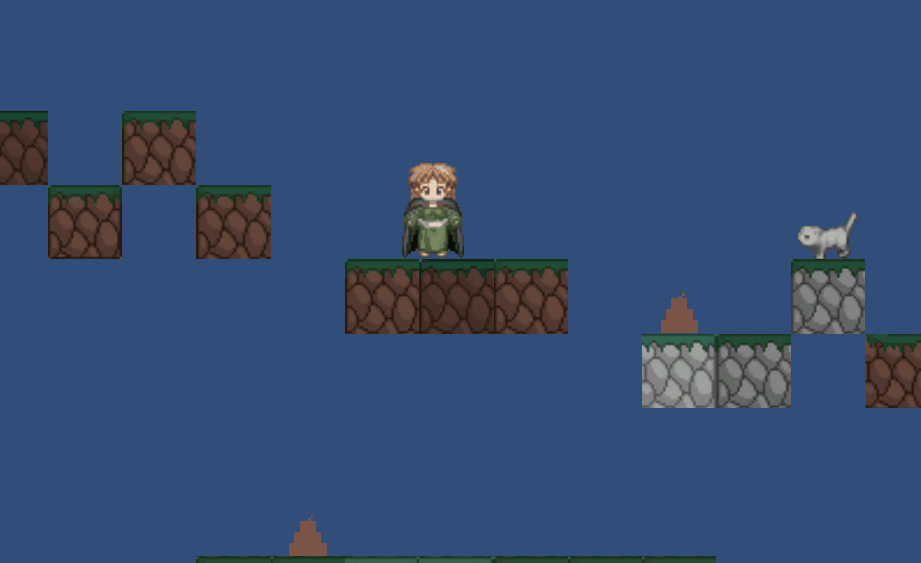

# ULLPrueba1
Primera prueba de fundamentos del desarrollo de videojuegos

El personaje se puede mover por el mapa utilizando WASD:

Acercarse a un enemigo reduce nuestra barra de poder. Acercarse al minino la aumenta. Los enemigos aparecen espontaneamente cada cierto tiempo y se mueven erráticamente:

Si entramos en contacto con un enemigo perdemos una vida. Morir sin tener vidas implica perder a empezar:

Recoger "mojones" aumenta nuestras vidas:

